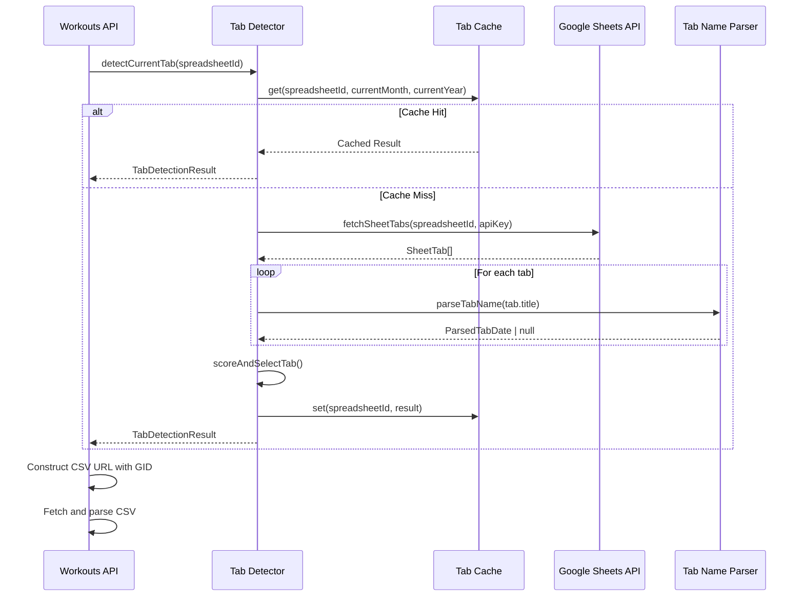
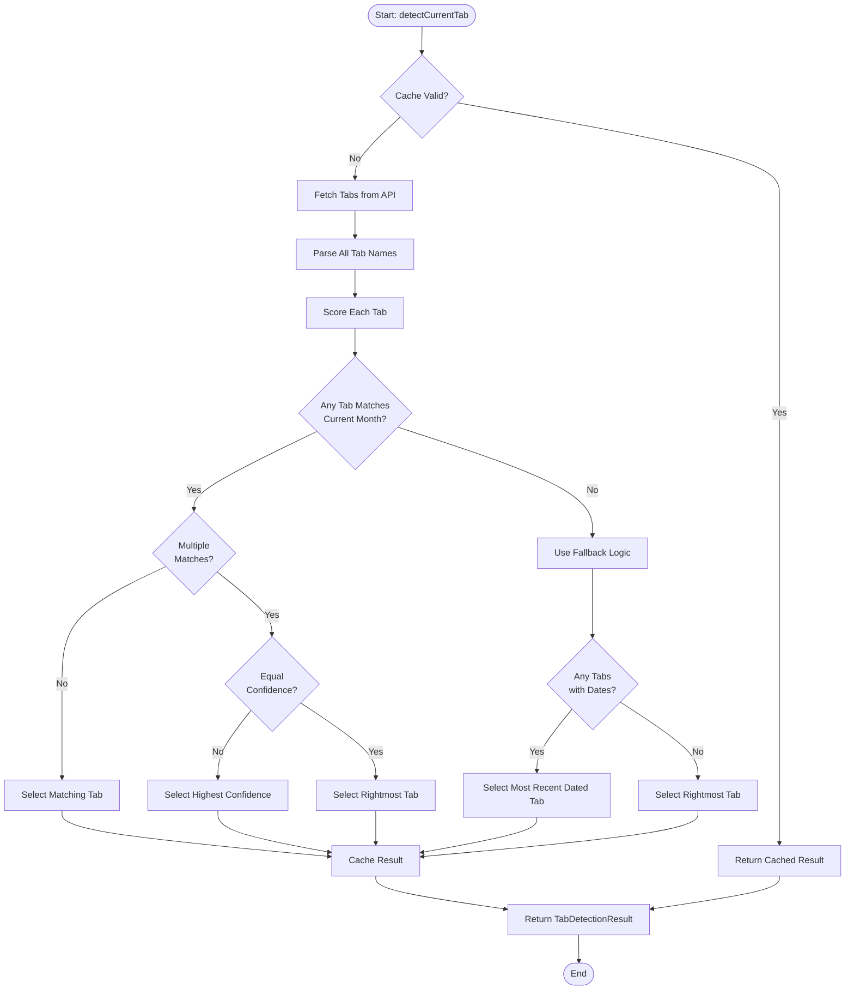
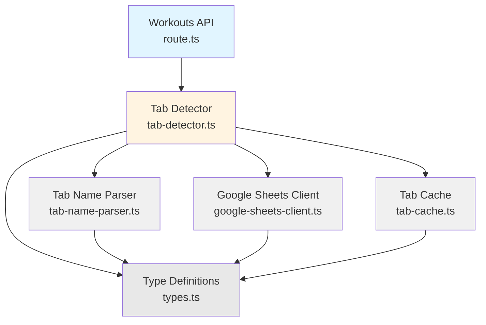

# Design Document: Dynamic Sheet Tab Detection

## Overview

The Dynamic Sheet Tab Detection system automatically identifies the correct Google Sheets tab containing the current month's programming by analyzing tab names and metadata. This eliminates the need for manual SHEET_GID updates when coaches add new monthly programming tabs.

The system uses the Google Sheets API v4 to retrieve tab metadata, parses tab names to extract date information, and selects the most appropriate tab based on confidence scoring. Results are cached in-memory to minimize API calls while respecting Google's rate limits.

## Architecture

### High-Level Flow

```
┌─────────────────┐
│ GET /api/workouts│
│   ?date=2026-02-01│
└────────┬────────┘
         │
         ▼
┌─────────────────────────┐
│ Tab Detection Service   │
│ 1. Check cache          │
│ 2. Fetch tabs if needed │
│ 3. Parse tab names      │
│ 4. Score & select       │
│ 5. Cache result         │
└────────┬────────────────┘
         │
         ▼
┌─────────────────────────┐
│ Google Sheets API v4    │
│ GET spreadsheets/{id}   │
│ ?fields=sheets.properties│
└────────┬────────────────┘
         │
         ▼
┌─────────────────────────┐
│ CSV Export with GID     │
│ /export?format=csv&gid= │
└─────────────────────────┘
```


### System Components

```
app/lib/sheets/
├── tab-detector.ts          # Main detection orchestrator
├── tab-name-parser.ts       # Date extraction from tab names
├── google-sheets-client.ts  # API v4 client wrapper
├── tab-cache.ts             # In-memory caching
└── types.ts                 # TypeScript interfaces

app/api/workouts/route.ts    # Updated to use tab detection
```

## Components and Interfaces

### 1. Tab Detector (tab-detector.ts)

**Purpose:** Orchestrates the tab detection process, coordinating cache checks, API calls, parsing, and selection logic.

**Interface:**
```typescript
export interface TabDetectionResult {
  sheetGid: string
  tabName: string
  confidence: number
  isFallback: boolean
  detectedDate?: { month: number; year: number }
  warning?: string
}

export async function detectCurrentTab(
  spreadsheetId: string
): Promise<TabDetectionResult>
```

**Algorithm:**
1. Check cache for valid result (within TTL and same month)
2. If cache miss, fetch all tabs from Google Sheets API
3. Parse each tab name to extract date information
4. Score each tab based on match with current month
5. Select highest-scoring tab (or fallback to rightmost)
6. Cache result with timestamp
7. Return detection result


### 2. Tab Name Parser (tab-name-parser.ts)

**Purpose:** Extracts date information from tab names using pattern matching and assigns confidence scores.

**Interface:**
```typescript
export interface ParsedTabDate {
  month: number  // 1-12
  year: number
  confidence: number  // 0.0 - 1.0
  pattern: string  // e.g., "Month YYYY", "YYYY-MM"
}

export function parseTabName(tabName: string): ParsedTabDate | null
```

**Parsing Patterns (in priority order):**

1. **"Month YYYY"** (e.g., "January 2026") → confidence: 1.0
   - Regex: `/\b(January|February|...|December)\s+(\d{4})\b/i`

2. **"Mon YYYY"** (e.g., "Jan 2026") → confidence: 0.95
   - Regex: `/\b(Jan|Feb|Mar|...|Dec)\s+(\d{4})\b/i`

3. **"YYYY-MM"** (e.g., "2026-01") → confidence: 0.9
   - Regex: `/\b(\d{4})-(\d{2})\b/`

4. **"MM/YYYY"** (e.g., "01/2026") → confidence: 0.85
   - Regex: `/\b(\d{1,2})\/(\d{4})\b/`

5. **"Month only"** (e.g., "January") → confidence: 0.7
   - Regex: `/\b(January|February|...|December)\b/i`
   - Assumes current year

6. **Ambiguous patterns** → confidence: 0.5
   - Contains numbers but unclear format

7. **No date info** → null

**Month Name Mapping:**
```typescript
const MONTH_NAMES = {
  'january': 1, 'jan': 1,
  'february': 2, 'feb': 2,
  // ... all months
}
```


### 3. Google Sheets Client (google-sheets-client.ts)

**Purpose:** Wrapper for Google Sheets API v4 with error handling and retry logic.

**Interface:**
```typescript
export interface SheetTab {
  sheetId: number  // This is the GID
  title: string
  index: number
}

export async function fetchSheetTabs(
  spreadsheetId: string,
  apiKey: string
): Promise<SheetTab[]>
```

**API Call:**
```typescript
const url = `https://sheets.googleapis.com/v4/spreadsheets/${spreadsheetId}?fields=sheets.properties(sheetId,title,index)&key=${apiKey}`

const response = await fetch(url, {
  method: 'GET',
  headers: { 'Accept': 'application/json' }
})
```

**Response Structure:**
```json
{
  "sheets": [
    {
      "properties": {
        "sheetId": 30816788,
        "title": "January 2026",
        "index": 0
      }
    }
  ]
}
```

**Error Handling:**
- 401/403: Invalid API key or permissions → Configuration error
- 404: Spreadsheet not found → Configuration error
- 429: Rate limit exceeded → Exponential backoff (3 retries)
- 500+: Server error → Retry with backoff

**Retry Logic:**
```typescript
async function fetchWithRetry(url: string, maxRetries = 3): Promise<Response> {
  for (let attempt = 0; attempt < maxRetries; attempt++) {
    try {
      const response = await fetch(url)
      if (response.status === 429) {
        const delay = Math.pow(2, attempt) * 1000  // 1s, 2s, 4s
        await sleep(delay)
        continue
      }
      return response
    } catch (error) {
      if (attempt === maxRetries - 1) throw error
    }
  }
  throw new Error('Max retries exceeded')
}
```


### 4. Tab Cache (tab-cache.ts)

**Purpose:** In-memory cache to minimize API calls and respect rate limits.

**Interface:**
```typescript
export interface CachedTabResult {
  sheetGid: string
  tabName: string
  confidence: number
  detectedMonth: number
  detectedYear: number
  timestamp: number
}

export class TabCache {
  private cache: Map<string, CachedTabResult> = new Map()
  
  get(spreadsheetId: string, currentMonth: number, currentYear: number): CachedTabResult | null
  set(spreadsheetId: string, result: CachedTabResult): void
  clear(): void
  isExpired(timestamp: number, ttlHours: number): boolean
}
```

**Cache Key:** `${spreadsheetId}`

**Cache Invalidation Rules:**
1. TTL expired (default 4 hours)
2. Current month changed (new month started)
3. Manual clear (for testing/debugging)

**Implementation:**
```typescript
export class TabCache {
  private cache = new Map<string, CachedTabResult>()
  
  get(spreadsheetId: string, currentMonth: number, currentYear: number): CachedTabResult | null {
    const cached = this.cache.get(spreadsheetId)
    if (!cached) return null
    
    const ttlHours = parseInt(process.env.GOOGLE_SHEETS_CACHE_TTL_HOURS || '4')
    const ttlMs = ttlHours * 60 * 60 * 1000
    const isExpired = Date.now() - cached.timestamp > ttlMs
    
    // Invalidate if expired or month changed
    if (isExpired || cached.detectedMonth !== currentMonth || cached.detectedYear !== currentYear) {
      this.cache.delete(spreadsheetId)
      return null
    }
    
    return cached
  }
  
  set(spreadsheetId: string, result: CachedTabResult): void {
    this.cache.set(spreadsheetId, result)
  }
}

// Singleton instance
export const tabCache = new TabCache()
```


### 5. Type Definitions (types.ts)

```typescript
export interface SheetTab {
  sheetId: number  // GID for CSV export
  title: string
  index: number
}

export interface ParsedTabDate {
  month: number  // 1-12
  year: number
  confidence: number  // 0.0 - 1.0
  pattern: string
}

export interface ScoredTab {
  tab: SheetTab
  parsedDate: ParsedTabDate | null
  score: number  // Combined score for selection
}

export interface TabDetectionResult {
  sheetGid: string
  tabName: string
  confidence: number
  isFallback: boolean
  detectedDate?: { month: number; year: number }
  warning?: string
}

export interface CachedTabResult {
  sheetGid: string
  tabName: string
  confidence: number
  detectedMonth: number
  detectedYear: number
  timestamp: number
}

export class TabDetectionError extends Error {
  constructor(
    message: string,
    public code: 'API_ERROR' | 'CONFIG_ERROR' | 'PARSE_ERROR' | 'NO_TABS_FOUND',
    public details?: any
  ) {
    super(message)
    this.name = 'TabDetectionError'
  }
}
```


## Data Models

### Tab Selection Scoring Algorithm

**Scoring Formula:**
```typescript
function scoreTab(tab: SheetTab, parsedDate: ParsedTabDate | null, currentMonth: number, currentYear: number): number {
  // No date parsed → score 0
  if (!parsedDate) return 0
  
  // Exact month/year match → use confidence score
  if (parsedDate.month === currentMonth && parsedDate.year === currentYear) {
    return parsedDate.confidence
  }
  
  // No match → score 0
  return 0
}
```

**Selection Logic:**
```typescript
function selectBestTab(tabs: SheetTab[], currentMonth: number, currentYear: number): TabDetectionResult {
  const scoredTabs: ScoredTab[] = tabs.map(tab => ({
    tab,
    parsedDate: parseTabName(tab.title),
    score: scoreTab(tab, parsedDate, currentMonth, currentYear)
  }))
  
  // Find tabs matching current month
  const matchingTabs = scoredTabs.filter(st => st.score > 0)
  
  if (matchingTabs.length > 0) {
    // Sort by score (desc), then by index (desc) for ties
    matchingTabs.sort((a, b) => {
      if (b.score !== a.score) return b.score - a.score
      return b.tab.index - a.tab.index
    })
    
    const best = matchingTabs[0]
    return {
      sheetGid: best.tab.sheetId.toString(),
      tabName: best.tab.title,
      confidence: best.score,
      isFallback: false,
      detectedDate: best.parsedDate ? { month: best.parsedDate.month, year: best.parsedDate.year } : undefined
    }
  }
  
  // Fallback: Use most recent dated tab or rightmost tab
  return selectFallbackTab(scoredTabs)
}
```


**Fallback Selection:**
```typescript
function selectFallbackTab(scoredTabs: ScoredTab[]): TabDetectionResult {
  // Find most recent dated tab
  const datedTabs = scoredTabs.filter(st => st.parsedDate !== null)
  
  if (datedTabs.length > 0) {
    // Sort by year (desc), then month (desc), then index (desc)
    datedTabs.sort((a, b) => {
      const aDate = a.parsedDate!
      const bDate = b.parsedDate!
      
      if (bDate.year !== aDate.year) return bDate.year - aDate.year
      if (bDate.month !== aDate.month) return bDate.month - aDate.month
      return b.tab.index - a.tab.index
    })
    
    const fallback = datedTabs[0]
    return {
      sheetGid: fallback.tab.sheetId.toString(),
      tabName: fallback.tab.title,
      confidence: fallback.parsedDate!.confidence,
      isFallback: true,
      detectedDate: { month: fallback.parsedDate!.month, year: fallback.parsedDate!.year },
      warning: 'No tab found for current month, using most recent dated tab'
    }
  }
  
  // No dated tabs found → use rightmost tab
  const rightmost = scoredTabs.reduce((max, st) => 
    st.tab.index > max.tab.index ? st : max
  )
  
  return {
    sheetGid: rightmost.tab.sheetId.toString(),
    tabName: rightmost.tab.title,
    confidence: 0.5,
    isFallback: true,
    warning: 'No dated tabs found, using rightmost tab'
  }
}
```


## Correctness Properties

A property is a characteristic or behavior that should hold true across all valid executions of a system—essentially, a formal statement about what the system should do. Properties serve as the bridge between human-readable specifications and machine-verifiable correctness guarantees.

### Property 1: Tab Metadata Extraction Completeness
*For any* valid Google Sheets API response containing tab data, the Tab_Detector should extract all three required fields (sheetId, title, index) for every tab in the response.
**Validates: Requirements 1.3**

### Property 2: Date Format Parsing with Confidence Scoring
*For any* tab name containing a date in a recognized format (Month YYYY, Mon YYYY, YYYY-MM, MM/YYYY, or Month only), the Tab_Name_Parser should extract the correct month and year and assign the appropriate confidence score (1.0, 0.95, 0.9, 0.85, or 0.7 respectively).
**Validates: Requirements 2.1, 2.2, 2.3, 2.4, 2.6, 10.1, 10.2, 10.3, 10.4, 10.5**

### Property 3: Non-Date Tab Names Return Null
*For any* tab name containing no recognizable date information, the Tab_Name_Parser should return null (or confidence 0.0).
**Validates: Requirements 2.7, 10.7**

### Property 4: Current Month Tab Selection
*For any* set of tabs where at least one tab matches the current month and year, the Tab_Detector should select a tab matching the current month (not a past or future month).
**Validates: Requirements 3.1**


### Property 5: Highest Confidence Selection with Tiebreaker
*For any* set of tabs with multiple tabs matching the current month, the Tab_Detector should select the tab with the highest confidence score, and if multiple tabs have equal confidence, it should select the tab with the highest index (rightmost).
**Validates: Requirements 3.3, 3.4**

### Property 6: Fallback to Most Recent Dated Tab
*For any* set of tabs where no tab matches the current month but at least one tab contains a recognizable date, the Tab_Detector should select the most recently dated tab and mark the result as fallback.
**Validates: Requirements 3.5, 4.1, 4.4**

### Property 7: Fallback to Rightmost Tab
*For any* set of tabs where no tab contains recognizable date information, the Tab_Detector should select the rightmost tab (highest index) and mark the result as fallback.
**Validates: Requirements 4.2, 4.4**

### Property 8: Cache Hit Avoids API Call
*For any* spreadsheet where a valid cached result exists (within TTL and matching current month), calling detectCurrentTab should return the cached result without making a Google Sheets API call.
**Validates: Requirements 5.1, 5.3**

### Property 9: Cache Expiration After TTL
*For any* cached result, if the time elapsed since caching exceeds the configured TTL (default 4 hours), the cache should return null and force a fresh API call.
**Validates: Requirements 5.2**

### Property 10: Cache Invalidation on Month Change
*For any* cached result from a previous month, when the current date advances to a new month, the cache should return null and force a fresh detection.
**Validates: Requirements 5.4**

### Property 11: Error Results Not Cached
*For any* detection attempt that results in an error, the Tab_Cache should not store the error result.
**Validates: Requirements 5.5**


### Property 12: CSV URL Construction with Detected GID
*For any* Tab_GID returned by the Tab_Detector, the Workouts_API should construct a CSV export URL in the format `https://docs.google.com/spreadsheets/d/{SHEET_ID}/export?format=csv&gid={Tab_GID}`.
**Validates: Requirements 6.2**

### Property 13: Error Response with Troubleshooting Guidance
*For any* tab detection failure, the Workouts_API should return an error response containing troubleshooting guidance.
**Validates: Requirements 6.4**

### Property 14: Exponential Backoff on Rate Limiting
*For any* Google Sheets API call that returns a 429 (rate limit) status, the system should retry with exponential backoff delays (1s, 2s, 4s) up to a maximum of 3 retries.
**Validates: Requirements 7.5**

### Property 15: Fallback Response Includes Warning
*For any* tab detection result where isFallback is true, the response should include a warning field explaining why fallback mode was used.
**Validates: Requirements 4.3, 8.6**

## Error Handling

### Error Types

```typescript
export class TabDetectionError extends Error {
  constructor(
    message: string,
    public code: 'API_ERROR' | 'CONFIG_ERROR' | 'PARSE_ERROR' | 'NO_TABS_FOUND',
    public details?: any
  ) {
    super(message)
    this.name = 'TabDetectionError'
  }
}
```


### Error Scenarios

**Configuration Errors:**
- Missing GOOGLE_SHEETS_API_KEY → Return CONFIG_ERROR with setup instructions
- Missing SHEET_ID → Return CONFIG_ERROR with configuration guidance
- Invalid spreadsheet ID format → Return CONFIG_ERROR

**API Errors:**
- 401/403 (Unauthorized/Forbidden) → Return API_ERROR with permissions guidance
- 404 (Not Found) → Return API_ERROR indicating spreadsheet not found
- 429 (Rate Limited) → Retry with exponential backoff, return API_ERROR if max retries exceeded
- 500+ (Server Error) → Retry with backoff, return API_ERROR if persistent

**Parse Errors:**
- No tabs found in response → Return NO_TABS_FOUND
- Invalid API response structure → Return PARSE_ERROR

**Fallback Scenarios (Not Errors):**
- No tab matches current month → Use fallback logic, return success with warning
- No tabs contain dates → Use rightmost tab, return success with warning

### Logging Strategy

**Log Levels:**
- **INFO**: Successful detection, cache hits
- **WARN**: Fallback mode activated, ambiguous tab names
- **ERROR**: API failures, configuration errors, parse errors

**Log Format:**
```typescript
{
  timestamp: ISO8601,
  level: 'INFO' | 'WARN' | 'ERROR',
  component: 'TabDetector' | 'TabNameParser' | 'GoogleSheetsClient' | 'TabCache',
  action: string,
  details: {
    spreadsheetId?: string,
    selectedTab?: string,
    selectedGid?: string,
    confidence?: number,
    isFallback?: boolean,
    errorCode?: string,
    errorMessage?: string
  }
}
```


**Example Logs:**

```typescript
// Successful detection
console.log({
  timestamp: '2026-02-01T10:30:00Z',
  level: 'INFO',
  component: 'TabDetector',
  action: 'tab_detected',
  details: {
    spreadsheetId: '1Y0n4WgGu...',
    selectedTab: 'February 2026',
    selectedGid: '12345678',
    confidence: 1.0,
    isFallback: false
  }
})

// Fallback mode
console.warn({
  timestamp: '2026-02-01T10:30:00Z',
  level: 'WARN',
  component: 'TabDetector',
  action: 'fallback_activated',
  details: {
    spreadsheetId: '1Y0n4WgGu...',
    selectedTab: 'January 2026',
    selectedGid: '87654321',
    confidence: 1.0,
    isFallback: true,
    reason: 'No tab found for current month (February 2026)'
  }
})

// API error
console.error({
  timestamp: '2026-02-01T10:30:00Z',
  level: 'ERROR',
  component: 'GoogleSheetsClient',
  action: 'api_call_failed',
  details: {
    spreadsheetId: '1Y0n4WgGu...',
    errorCode: 'API_ERROR',
    errorMessage: 'Rate limit exceeded',
    retryAttempt: 3
  }
})
```


## Testing Strategy

### Dual Testing Approach

This feature requires both unit tests and property-based tests for comprehensive coverage:

**Unit Tests** focus on:
- Specific date format examples (e.g., "January 2026", "2026-01")
- Error conditions (missing API key, invalid responses)
- Edge cases (empty tab list, all tabs without dates)
- Integration points (Workouts API calling Tab Detector)
- Logging behavior verification

**Property-Based Tests** focus on:
- Universal properties across all inputs (any valid date format should parse)
- Randomized tab name generation
- Comprehensive confidence score validation
- Cache behavior across time ranges
- Selection logic with various tab combinations

### Property-Based Testing Configuration

**Library:** fast-check (for TypeScript/JavaScript)

**Configuration:**
- Minimum 100 iterations per property test
- Each test tagged with feature name and property number
- Tag format: `Feature: dynamic-sheet-tab-detection, Property {N}: {description}`

**Example Property Test:**
```typescript
import * as fc from 'fast-check'
import { describe, it, expect } from 'vitest'
import { parseTabName } from '@/app/lib/sheets/tab-name-parser'

describe('Tab Name Parser - Property Tests', () => {
  it('Property 2: Date format parsing with confidence scoring', () => {
    // Feature: dynamic-sheet-tab-detection, Property 2
    fc.assert(
      fc.property(
        fc.record({
          month: fc.integer({ min: 1, max: 12 }),
          year: fc.integer({ min: 2020, max: 2030 })
        }),
        ({ month, year }) => {
          const monthNames = ['January', 'February', 'March', 'April', 'May', 'June',
                             'July', 'August', 'September', 'October', 'November', 'December']
          const tabName = `${monthNames[month - 1]} ${year}`
          
          const result = parseTabName(tabName)
          
          expect(result).not.toBeNull()
          expect(result!.month).toBe(month)
          expect(result!.year).toBe(year)
          expect(result!.confidence).toBe(1.0)
        }
      ),
      { numRuns: 100 }
    )
  })
})
```


### Unit Test Examples

**Tab Name Parser Tests:**
```typescript
describe('Tab Name Parser - Unit Tests', () => {
  it('should parse "January 2026" with confidence 1.0', () => {
    const result = parseTabName('January 2026')
    expect(result).toEqual({
      month: 1,
      year: 2026,
      confidence: 1.0,
      pattern: 'Month YYYY'
    })
  })
  
  it('should parse "Jan 2026" with confidence 0.95', () => {
    const result = parseTabName('Jan 2026')
    expect(result).toEqual({
      month: 1,
      year: 2026,
      confidence: 0.95,
      pattern: 'Mon YYYY'
    })
  })
  
  it('should return null for non-date tab names', () => {
    expect(parseTabName('Sheet1')).toBeNull()
    expect(parseTabName('Data')).toBeNull()
    expect(parseTabName('Random Text')).toBeNull()
  })
})
```

**Tab Detector Tests:**
```typescript
describe('Tab Detector - Unit Tests', () => {
  it('should select current month tab when available', async () => {
    const mockTabs = [
      { sheetId: 1, title: 'January 2026', index: 0 },
      { sheetId: 2, title: 'February 2026', index: 1 }
    ]
    
    // Mock current date as February 2026
    jest.useFakeTimers().setSystemTime(new Date('2026-02-01'))
    
    const result = await detectCurrentTab('test-sheet-id')
    
    expect(result.sheetGid).toBe('2')
    expect(result.tabName).toBe('February 2026')
    expect(result.isFallback).toBe(false)
  })
  
  it('should use fallback when current month not found', async () => {
    const mockTabs = [
      { sheetId: 1, title: 'January 2026', index: 0 },
      { sheetId: 2, title: 'March 2026', index: 1 }
    ]
    
    // Mock current date as February 2026
    jest.useFakeTimers().setSystemTime(new Date('2026-02-01'))
    
    const result = await detectCurrentTab('test-sheet-id')
    
    expect(result.sheetGid).toBe('2')  // Most recent dated tab
    expect(result.isFallback).toBe(true)
    expect(result.warning).toContain('No tab found for current month')
  })
})
```


**Cache Tests:**
```typescript
describe('Tab Cache - Unit Tests', () => {
  it('should return cached result within TTL', () => {
    const cache = new TabCache()
    const result = {
      sheetGid: '123',
      tabName: 'February 2026',
      confidence: 1.0,
      detectedMonth: 2,
      detectedYear: 2026,
      timestamp: Date.now()
    }
    
    cache.set('test-sheet-id', result)
    
    const cached = cache.get('test-sheet-id', 2, 2026)
    expect(cached).toEqual(result)
  })
  
  it('should return null after TTL expires', () => {
    const cache = new TabCache()
    const result = {
      sheetGid: '123',
      tabName: 'February 2026',
      confidence: 1.0,
      detectedMonth: 2,
      detectedYear: 2026,
      timestamp: Date.now() - (5 * 60 * 60 * 1000)  // 5 hours ago
    }
    
    cache.set('test-sheet-id', result)
    
    const cached = cache.get('test-sheet-id', 2, 2026)
    expect(cached).toBeNull()
  })
  
  it('should invalidate cache when month changes', () => {
    const cache = new TabCache()
    const result = {
      sheetGid: '123',
      tabName: 'January 2026',
      confidence: 1.0,
      detectedMonth: 1,
      detectedYear: 2026,
      timestamp: Date.now()
    }
    
    cache.set('test-sheet-id', result)
    
    // Try to get for February (different month)
    const cached = cache.get('test-sheet-id', 2, 2026)
    expect(cached).toBeNull()
  })
})
```


**Google Sheets Client Tests:**
```typescript
describe('Google Sheets Client - Unit Tests', () => {
  it('should handle 401 unauthorized errors', async () => {
    global.fetch = jest.fn().mockResolvedValue({
      ok: false,
      status: 401,
      json: async () => ({ error: 'Invalid API key' })
    })
    
    await expect(fetchSheetTabs('test-sheet-id', 'invalid-key'))
      .rejects.toThrow(TabDetectionError)
  })
  
  it('should retry on 429 rate limit with exponential backoff', async () => {
    let callCount = 0
    global.fetch = jest.fn().mockImplementation(() => {
      callCount++
      if (callCount < 3) {
        return Promise.resolve({ ok: false, status: 429 })
      }
      return Promise.resolve({
        ok: true,
        json: async () => ({ sheets: [] })
      })
    })
    
    await fetchSheetTabs('test-sheet-id', 'valid-key')
    
    expect(callCount).toBe(3)
  })
})
```

### Test Coverage Goals

- **Line Coverage:** >90%
- **Branch Coverage:** >85%
- **Function Coverage:** 100%
- **Property Test Iterations:** 100 per property

### Testing Checklist

- [ ] All date format patterns tested (Month YYYY, Mon YYYY, YYYY-MM, MM/YYYY, Month only)
- [ ] All confidence scores validated (1.0, 0.95, 0.9, 0.85, 0.7, 0.5, 0.0)
- [ ] Current month selection logic tested
- [ ] Fallback logic tested (most recent dated tab, rightmost tab)
- [ ] Cache hit/miss scenarios tested
- [ ] Cache TTL expiration tested
- [ ] Cache invalidation on month change tested
- [ ] API error handling tested (401, 403, 404, 429, 500+)
- [ ] Retry logic with exponential backoff tested
- [ ] Configuration error handling tested
- [ ] Logging behavior verified
- [ ] Integration with Workouts API tested


## Implementation Notes

### Environment Variables

**Required:**
```bash
GOOGLE_SHEETS_API_KEY=your-api-key-here
```

**Optional:**
```bash
GOOGLE_SHEETS_CACHE_TTL_HOURS=4  # Default: 4 hours
```

**Existing (used by implementation):**
```bash
# Spreadsheet ID extracted from this constant in code
SHEET_ID=1Y0n4WgGu_MzJDDS-6-iAQlaMuZpULj1DIYioSbVW08g
```

### API Key Setup

1. Go to [Google Cloud Console](https://console.cloud.google.com/)
2. Create or select a project
3. Enable Google Sheets API v4
4. Create API key (Credentials → Create Credentials → API Key)
5. Restrict key to Google Sheets API only
6. Add key to environment variables

### Migration Path

**Phase 1: Add Tab Detection (Non-Breaking)**
- Implement tab detection system
- Keep hardcoded SHEET_GID as fallback
- Log detection results for validation

**Phase 2: Enable Dynamic Detection**
- Switch Workouts API to use tab detection
- Remove hardcoded SHEET_GID
- Monitor logs for issues

**Phase 3: Cleanup**
- Remove old CSV URL environment variable
- Update documentation
- Remove fallback code


### Performance Considerations

**API Call Optimization:**
- Cache results for 4 hours (configurable)
- Use `fields` parameter to minimize response size
- Only fetch tab metadata, not cell data

**Expected API Usage:**
- ~6 calls per day per user (every 4 hours)
- ~180 calls per month per user
- Well within Google Sheets API free tier (300 requests per minute per project)

**Memory Usage:**
- Cache stored in-memory (not database)
- Minimal memory footprint (~100 bytes per cached result)
- Cache cleared on server restart (acceptable)

**Response Time:**
- Cache hit: <5ms
- Cache miss: ~200-500ms (API call + parsing)
- Acceptable for non-critical path

### Security Considerations

**API Key Protection:**
- Store in environment variables (never commit to code)
- Use server-side only (never expose to client)
- Restrict key to Google Sheets API only
- Consider IP restrictions if possible

**Spreadsheet Access:**
- Spreadsheet must be publicly readable OR
- Use service account authentication (future enhancement)
- No write access needed (read-only)

**Error Information:**
- Don't expose API keys in error messages
- Don't expose full spreadsheet URLs to client
- Log sensitive info server-side only


### Future Enhancements

**Service Account Authentication:**
- Support private spreadsheets
- More secure than API key
- Better for production use

**Multi-User Support:**
- Allow users to configure their own spreadsheet
- Store spreadsheet ID in user_profiles table
- Per-user cache entries

**Smart Caching:**
- Detect when new tabs are added
- Invalidate cache when sheet structure changes
- Use ETags for conditional requests

**Advanced Parsing:**
- Support more date formats
- Handle multi-language month names
- Parse date ranges (e.g., "Jan 1-31")

**Monitoring:**
- Track detection success rate
- Alert on repeated fallback usage
- Monitor API quota usage

**User Feedback:**
- Show detected tab name in UI
- Allow manual tab override
- Provide tab selection dropdown

## Diagrams

### Tab Detection Flow




### Tab Selection Decision Tree




### Component Dependencies



## Summary

The Dynamic Sheet Tab Detection system provides automatic identification of the correct Google Sheets tab for monthly programming by:

1. **Fetching tab metadata** from Google Sheets API v4
2. **Parsing tab names** to extract date information with confidence scoring
3. **Selecting the best tab** based on current month matching and confidence scores
4. **Caching results** to minimize API calls and respect rate limits
5. **Falling back gracefully** when current month tabs aren't found
6. **Logging comprehensively** for debugging and monitoring

This eliminates manual SHEET_GID updates while maintaining reliability through intelligent fallback logic and comprehensive error handling.
