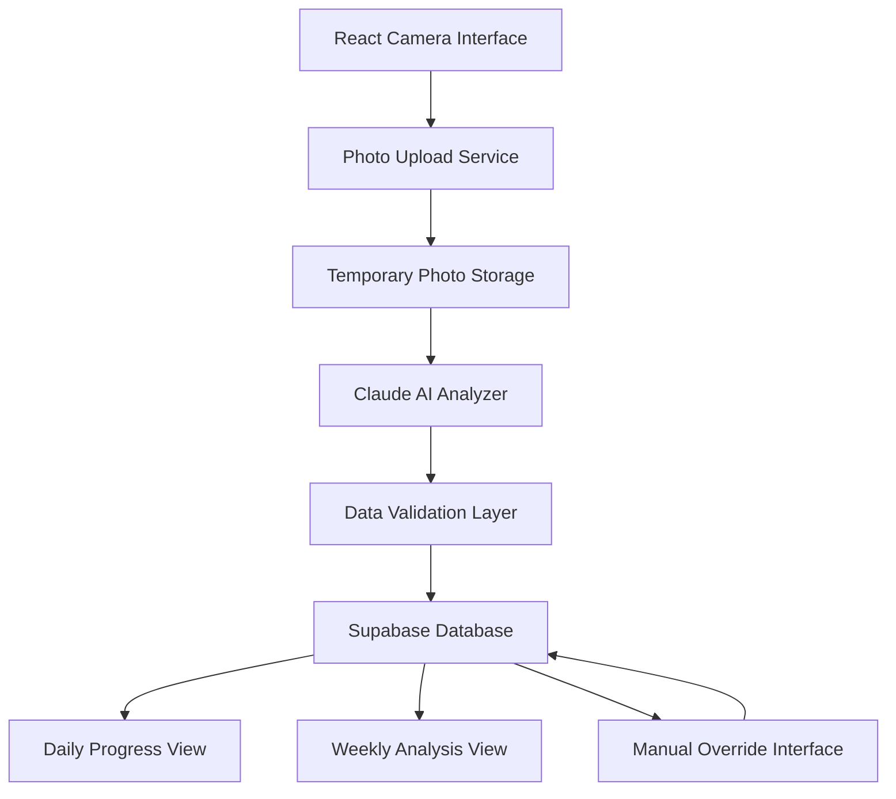

# Design Document: Food Tracking Feature

## Overview

The Food Tracking Feature integrates AI-powered meal analysis into the existing CrossFit training app, enabling users to log meals through photo capture with automatic macro and calorie extraction. The system prioritizes ease of use with a target of <30 seconds per meal logging while maintaining data accuracy through AI analysis and manual override capabilities.

The design follows a robust data pipeline approach, focusing on clean data ingestion and storage to enable future analysis features. The architecture separates concerns between photo capture, AI processing, data storage, and user interface components.

## Architecture

### High-Level Architecture



### Component Architecture

The system consists of five primary layers:

1. **Presentation Layer**: React components for photo capture, meal display, and progress tracking
2. **API Layer**: Next.js API routes handling photo upload, AI processing, and data operations
3. **AI Processing Layer**: Claude API integration for nutritional analysis
4. **Storage Layer**: Temporary photo storage (Google Drive/S3) and Supabase database
5. **Validation Layer**: Data quality checks and business logic enforcement

### Data Flow

1. User captures meal photo through React camera interface
2. Photo uploads to temporary storage with 30-day expiration
3. Claude API processes photo and returns structured nutritional data
4. Validation layer checks data quality and flags anomalies
5. Meal data stores in Supabase with needs_review flag
6. User views meal in daily progress interface
7. Optional manual corrections update data with override flag

## Components and Interfaces

### Frontend Components

#### MealCameraCapture
- **Purpose**: Handle photo capture and initial upload
- **Props**: `onPhotoCapture: (photo: File) => void`, `isLoading: boolean`
- **State**: Camera permissions, photo preview, upload progress
- **Key Methods**: `capturePhoto()`, `uploadPhoto()`, `retakePhoto()`

#### MealEntryCard
- **Purpose**: Display individual meal with nutritional breakdown
- **Props**: `meal: MealEntry`, `onEdit: (mealId: string) => void`
- **Features**: Photo preview, macro display, edit button, AI confidence indicator
- **Responsive**: Mobile-first design with touch-friendly interactions

#### DailyProgressView
- **Purpose**: Show daily meal summary and target progress
- **Props**: `date: Date`, `meals: MealEntry[]`, `targets: DailyTargets`
- **Features**: Running totals, target adherence indicators, add meal button
- **Real-time**: Updates as new meals are logged

#### WeeklyAdherenceView
- **Purpose**: Display weekly patterns and adherence scoring
- **Props**: `weekStart: Date`, `dailySummaries: DailySummary[]`
- **Features**: Daily adherence grid, weekly score calculation, improvement suggestions

#### MealEditModal
- **Purpose**: Manual correction interface for AI analysis
- **Props**: `meal: MealEntry`, `onSave: (updates: MealUpdates) => void`
- **Features**: Editable macro fields, portion adjustments, revert to AI option

### API Endpoints

#### POST /api/meals/upload
- **Purpose**: Handle photo upload and trigger AI analysis
- **Input**: `{ photo: File, userId: string, timestamp: string }`
- **Output**: `{ mealId: string, analysisStatus: 'processing' | 'complete' | 'failed' }`
- **Process**: Upload to storage → Queue AI analysis → Return meal ID

#### POST /api/meals/analyze
- **Purpose**: Process photo through Claude API
- **Input**: `{ photoUrl: string, mealId: string }`
- **Output**: `{ nutritionalData: NutritionalAnalysis, confidence: number }`
- **Claude Prompt**: Structured prompt for food identification and macro calculation

#### GET /api/meals/daily
- **Purpose**: Retrieve daily meal summary
- **Input**: `{ userId: string, date: string }`
- **Output**: `{ meals: MealEntry[], dailyTotals: MacroTotals, adherence: AdherenceStatus }`

#### PUT /api/meals/:id/override
- **Purpose**: Save manual corrections to meal data
- **Input**: `{ macroUpdates: MacroTotals, itemUpdates?: FoodItem[] }`
- **Output**: `{ updatedMeal: MealEntry }`
- **Process**: Preserve original AI data → Apply overrides → Set manual_override flag

### AI Integration

#### Claude API Configuration
- **Model**: Claude-3.5-Sonnet for optimal vision and reasoning capabilities
- **Image Requirements**: Max 8000x8000px, JPEG/PNG format, <30MB file size
- **Prompt Strategy**: Structured prompt with specific output format requirements
- **Error Handling**: Retry logic for API failures, fallback to manual entry

#### Nutritional Analysis Prompt
```
Analyze this meal photo and extract nutritional information. Return JSON with:
{
  "meal_items": [
    {
      "food": "specific food name",
      "portion": "estimated portion with units",
      "protein": number,
      "carbs": number,
      "fat": number,
      "calories": number
    }
  ],
  "total_macros": {
    "protein": total_protein,
    "carbs": total_carbs,
    "fat": total_fat,
    "calories": total_calories
  },
  "confidence": 0.0-1.0
}

Guidelines:
- Identify all visible food items
- Estimate portions in standard units (oz, cups, grams)
- Use USDA nutritional data for calculations
- Flag unusual combinations or unclear items
- Return confidence score based on image clarity
```

## Data Models

### Database Schema

#### meals Table
```sql
CREATE TABLE meals (
  id UUID PRIMARY KEY DEFAULT gen_random_uuid(),
  user_id UUID NOT NULL REFERENCES auth.users(id),
  meal_timestamp TIMESTAMPTZ NOT NULL,
  photo_url TEXT,
  photo_expires_at TIMESTAMPTZ,
  items JSONB NOT NULL, -- Array of food items
  total_protein DECIMAL(6,2) NOT NULL,
  total_carbs DECIMAL(6,2) NOT NULL,
  total_fat DECIMAL(6,2) NOT NULL,
  total_calories DECIMAL(7,2) NOT NULL,
  needs_review BOOLEAN DEFAULT true,
  manual_override BOOLEAN DEFAULT false,
  ai_confidence DECIMAL(3,2),
  reviewed_at TIMESTAMPTZ,
  created_at TIMESTAMPTZ DEFAULT now(),
  updated_at TIMESTAMPTZ DEFAULT now()
);
```

#### daily_targets Table
```sql
CREATE TABLE daily_targets (
  user_id UUID PRIMARY KEY REFERENCES auth.users(id),
  target_protein DECIMAL(6,2) NOT NULL,
  target_carbs DECIMAL(6,2) NOT NULL,
  target_fat DECIMAL(6,2) NOT NULL,
  target_calories DECIMAL(7,2) NOT NULL,
  tolerance_pct DECIMAL(4,2) DEFAULT 5.0,
  updated_at TIMESTAMPTZ DEFAULT now()
);
```

#### daily_summaries View
```sql
CREATE VIEW daily_summaries AS
SELECT 
  user_id,
  DATE(meal_timestamp) as date,
  SUM(total_protein) as total_protein,
  SUM(total_carbs) as total_carbs,
  SUM(total_fat) as total_fat,
  SUM(total_calories) as total_calories,
  COUNT(*) as meal_count
FROM meals
GROUP BY user_id, DATE(meal_timestamp);
```

### TypeScript Interfaces

#### Core Data Types
```typescript
interface MealEntry {
  id: string;
  userId: string;
  mealTimestamp: Date;
  photoUrl?: string;
  photoExpiresAt?: Date;
  items: FoodItem[];
  totalProtein: number;
  totalCarbs: number;
  totalFat: number;
  totalCalories: number;
  needsReview: boolean;
  manualOverride: boolean;
  aiConfidence?: number;
  reviewedAt?: Date;
  createdAt: Date;
  updatedAt: Date;
}

interface FoodItem {
  food: string;
  portion: string;
  protein: number;
  carbs: number;
  fat: number;
  calories: number;
}

interface DailyTargets {
  userId: string;
  targetProtein: number;
  targetCarbs: number;
  targetFat: number;
  targetCalories: number;
  tolerancePct: number;
  updatedAt: Date;
}

interface DailySummary {
  userId: string;
  date: Date;
  totalProtein: number;
  totalCarbs: number;
  totalFat: number;
  totalCalories: number;
  mealCount: number;
  adherenceScore?: number;
  withinTolerance?: boolean;
}
```

Now I need to use the prework tool to analyze the acceptance criteria before writing the correctness properties:
## Correctness Properties

*A property is a characteristic or behavior that should hold true across all valid executions of a system—essentially, a formal statement about what the system should do. Properties serve as the bridge between human-readable specifications and machine-verifiable correctness guarantees.*

### Property 1: End-to-End Logging Performance
*For any* meal photo upload, the complete logging process (upload → AI analysis → data storage) should complete within 30 seconds
**Validates: Requirements 1.2, 1.3, 1.5**

### Property 2: AI Analysis Data Structure
*For any* successful AI analysis, the returned data should contain a meal_items array and total_macros object with all required nutritional fields
**Validates: Requirements 2.4**

### Property 3: Macro Calculation Consistency
*For any* set of food items with individual macro values, the total macros should equal the sum of all individual item macros
**Validates: Requirements 2.3, 5.3**

### Property 4: Data Storage Integrity
*For any* processed meal, the stored data should include all required fields (user_id, timestamp, macros, items) and maintain proper audit trail information
**Validates: Requirements 3.1, 3.4, 3.5**

### Property 5: Photo Lifecycle Management
*For any* uploaded meal photo, it should be stored with 30-day expiration metadata and automatically deleted when the expiration date is reached
**Validates: Requirements 3.2, 3.3, 10.1, 10.2**

### Property 6: Target Validation and Storage
*For any* nutritional target setting operation, all target values should be validated as positive numbers and stored with default 5% tolerance
**Validates: Requirements 4.1, 4.2, 4.5**

### Property 7: Daily Progress Calculation
*For any* date and user, the daily totals should equal the sum of all meals logged on that date
**Validates: Requirements 5.1, 5.3**

### Property 8: Adherence Scoring Algorithm
*For any* daily intake and target values, adherence within ±5% tolerance should score 100%, while adherence outside tolerance should score (1 - deviation/target) × 100
**Validates: Requirements 6.3, 6.4**

### Property 9: Weekly Score Aggregation
*For any* week of daily adherence scores, the weekly score should equal the average of all daily macro scores
**Validates: Requirements 6.5**

### Property 10: Data Quality Validation
*For any* meal data, protein values >500g or calorie values >5000 should be flagged for review, and incomplete macro data should be rejected
**Validates: Requirements 7.1, 7.2, 7.3, 7.4**

### Property 11: Manual Override Tracking
*For any* manual correction operation, the system should preserve original AI data, set manual_override flag to true, and timestamp the review
**Validates: Requirements 8.2, 8.3, 8.4**

### Property 12: Correction Guidance Generation
*For any* weekly adherence score below 90%, the system should provide specific guidance with calculated serving adjustments based on deviation percentages
**Validates: Requirements 9.1, 9.2, 9.3, 9.4**

### Property 13: Error Handling Resilience
*For any* AI analysis failure or storage error, the system should flag entries for manual review without blocking the user workflow
**Validates: Requirements 2.5, 10.5**

### Property 14: Photo URL Security
*For any* meal data query, expired photo URLs should not be returned and secure URLs should expire with the photo retention period
**Validates: Requirements 10.3, 10.4**

## Error Handling

### AI Analysis Failures
- **Timeout Handling**: If Claude API doesn't respond within 15 seconds, flag meal for manual entry
- **Invalid Response**: If AI returns malformed JSON or missing required fields, prompt user for manual input
- **Confidence Threshold**: If AI confidence score <0.6, automatically flag for review
- **Retry Logic**: Implement exponential backoff for temporary API failures (max 3 retries)

### Photo Upload Failures
- **Storage Errors**: Allow meal data entry even if photo upload fails
- **Size Validation**: Reject photos >30MB with user-friendly error message
- **Format Validation**: Accept only JPEG/PNG formats, convert HEIC on iOS devices
- **Network Issues**: Implement offline queuing for uploads when network is unavailable

### Data Validation Errors
- **Missing Fields**: Prevent save operations until all required macro values are provided
- **Range Validation**: Flag obviously incorrect values (protein >500g, calories >5000) for review
- **Type Validation**: Ensure all numeric fields contain valid numbers, not strings or null values
- **Constraint Violations**: Handle database constraint errors gracefully with user feedback

### User Experience Errors
- **Camera Permissions**: Provide clear instructions if camera access is denied
- **Loading States**: Show progress indicators during upload and AI processing
- **Network Connectivity**: Display offline status and queue operations for later sync
- **Session Expiry**: Handle authentication errors with automatic re-login prompts

## Testing Strategy

### Dual Testing Approach

The testing strategy employs both unit tests and property-based tests to ensure comprehensive coverage:

**Unit Tests** focus on:
- Specific examples that demonstrate correct behavior
- Edge cases and error conditions (empty inputs, boundary values)
- Integration points between components
- User interface interactions and state management

**Property-Based Tests** focus on:
- Universal properties that hold across all valid inputs
- Comprehensive input coverage through randomization
- Mathematical relationships and invariants
- Data consistency and integrity across operations

### Property-Based Testing Configuration

**Framework**: Use `fast-check` for TypeScript/JavaScript property-based testing
**Test Configuration**: Minimum 100 iterations per property test to ensure statistical confidence
**Test Tagging**: Each property test must reference its design document property using the format:
`// Feature: food-tracking, Property X: [property description]`

### Testing Implementation Requirements

**Property Test Examples**:
- Generate random meal data and verify macro calculation consistency
- Generate random target values and verify adherence scoring algorithms
- Generate random photo metadata and verify expiration handling
- Generate random user inputs and verify validation logic

**Unit Test Examples**:
- Test camera component with specific photo capture scenarios
- Test AI response parsing with known good/bad JSON examples
- Test manual override UI with specific correction workflows
- Test error handling with specific failure conditions

**Integration Test Requirements**:
- End-to-end meal logging workflow with real photo uploads
- Database operations with actual Supabase connections
- AI integration with Claude API using test images
- Photo storage operations with temporary storage services

### Performance Testing

**Load Testing**: Verify system handles concurrent meal uploads from multiple users
**Stress Testing**: Test AI processing queue under high volume conditions
**Latency Testing**: Ensure <30 second end-to-end logging time under normal conditions
**Storage Testing**: Verify photo cleanup processes don't impact system performance