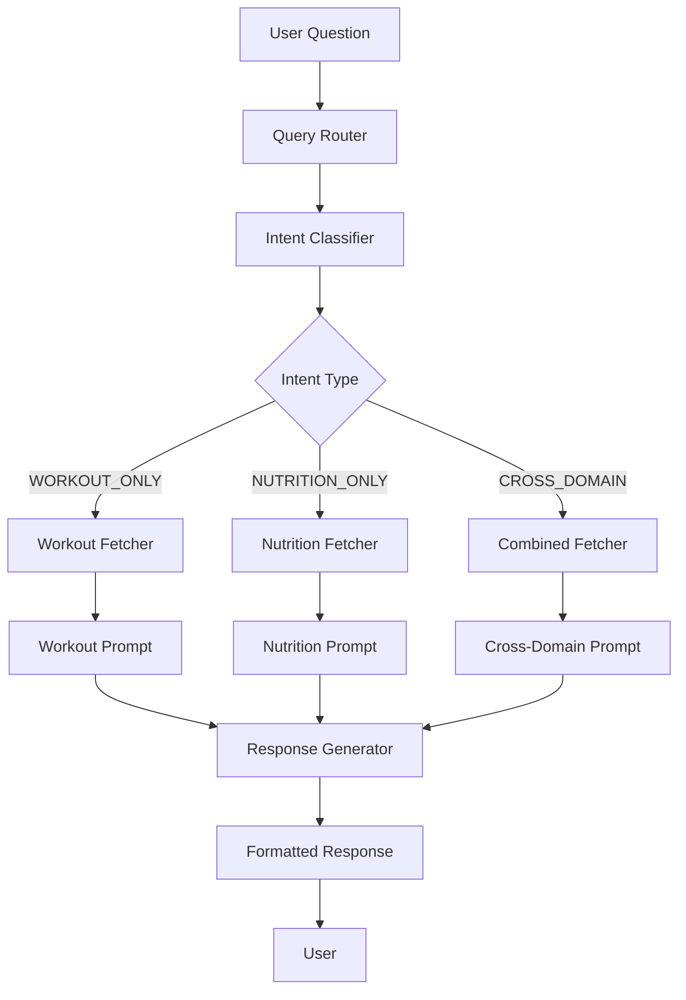

# Design Document: Holistic Query System

## Overview

The Holistic Query System transforms SociusFit's natural language query capability from a workout-only system into a unified, cross-domain fitness intelligence platform. The architecture uses an intent-based router pattern that classifies user questions, fetches domain-specific data efficiently, and applies specialized prompts to generate accurate, contextual responses.

The system follows a three-stage pipeline:
1. **Classification** - Determine query intent (workout, nutrition, cross-domain)
2. **Data Assembly** - Fetch only relevant data based on classification
3. **Response Generation** - Apply domain-specific prompts and synthesize answers

This design optimizes for token efficiency, response speed, and answer accuracy while enabling the holistic fitness insights that differentiate SociusFit.

## Architecture

### System Flow Diagram



### Component Architecture

```
app/api/query/
├── route.ts                    # Main API endpoint (refactored)
├── lib/
│   ├── intent-classifier.ts    # Intent classification logic
│   ├── domain-fetchers.ts      # Data fetching by domain
│   ├── prompt-templates.ts     # Domain-specific prompts
│   ├── response-generator.ts   # AI response synthesis
│   └── types.ts                # TypeScript interfaces
```

## Components and Interfaces

### Intent Classifier

The Intent Classifier analyzes the user's question to determine which data domains are relevant.

```typescript
// app/api/query/lib/types.ts

export type QueryIntent = 'WORKOUT_ONLY' | 'NUTRITION_ONLY' | 'CROSS_DOMAIN';

export interface ClassificationResult {
  intent: QueryIntent;
  confidence: number;
  reasoning: string;
  keywords: string[];
}

export interface QueryContext {
  userId: string;
  question: string;
  intent: QueryIntent;
  timeWindow: {
    start: Date;
    end: Date;
  };
}
```

```typescript
// app/api/query/lib/intent-classifier.ts

export async function classifyIntent(question: string): Promise<ClassificationResult> {
  // Uses Claude with a focused classification prompt
  // Returns intent type, confidence score, and detected keywords
}
```

**Classification Logic:**
- Workout keywords: "workout", "exercise", "lift", "deadlift", "squat", "bench", "PR", "AMRAP", "EMOM", "reps", "sets", "weight", "strength", "metcon", "WOD"
- Nutrition keywords: "eat", "ate", "meal", "food", "protein", "carbs", "fat", "calories", "macros", "diet", "nutrition", "breakfast", "lunch", "dinner"
- Cross-domain triggers: "affect", "impact", "correlation", "relationship", "before workout", "after workout", "performance and", "energy", "fuel"

### Domain Fetchers

Specialized data retrieval functions that fetch only what's needed based on intent.

```typescript
// app/api/query/lib/domain-fetchers.ts

export interface WorkoutData {
  workouts: Array<{
    workout_date: string;
    input_text: string;
    primary_score: string | null;
    blocks: unknown;
    rpe: number | null;
    tags: string[];
  }>;
  benchmarkPrs: Array<{
    benchmark_name: string;
    date: string;
    score_value: number;
    score_display: string;
    rx_status: string;
  }>;
}

export interface NutritionData {
  meals: Array<{
    meal_timestamp: string;
    meal_name: string;
    total_protein: number;
    total_carbs: number;
    total_fat: number;
    total_calories: number;
    meal_timing: string | null;
  }>;
  dailyTargets: {
    target_protein: number;
    target_carbs: number;
    target_fat: number;
    target_calories: number;
  } | null;
  dailySummaries: Array<{
    date: string;
    total_protein: number;
    total_carbs: number;
    total_fat: number;
    total_calories: number;
    meal_count: number;
  }>;
}

export interface CrossDomainData {
  workout: WorkoutData;
  nutrition: NutritionData;
}

export async function fetchWorkoutData(
  supabase: SupabaseClient,
  userId: string,
  timeWindow: { start: Date; end: Date }
): Promise<WorkoutData>;

export async function fetchNutritionData(
  supabase: SupabaseClient,
  userId: string,
  timeWindow: { start: Date; end: Date }
): Promise<NutritionData>;

export async function fetchCrossDomainData(
  supabase: SupabaseClient,
  userId: string,
  timeWindow: { start: Date; end: Date }
): Promise<CrossDomainData>;
```

### Prompt Templates

Domain-specific system prompts optimized for each query type.

```typescript
// app/api/query/lib/prompt-templates.ts

export const WORKOUT_SYSTEM_PROMPT = `You are a fitness tracking assistant analyzing workout history.

DATA AVAILABLE:
- workouts: Array with date, input_text (workout description), primary_score, blocks, rpe, tags
- benchmarkPrs: Personal records for named benchmark workouts (Fran, Grace, etc.)

ANALYSIS CAPABILITIES:
- Parse input_text to find movements, weights, rep schemes
- Identify workout types (AMRAP, For Time, EMOM, Strength, etc.)
- Track PRs and benchmark performances
- Analyze training frequency and patterns

RESPONSE GUIDELINES:
- Use human-readable dates with relative context ("January 15, 2026 - 4 days ago")
- Quote relevant workout details when answering
- If data not found, explain what was searched
- Be conversational and specific`;

export const NUTRITION_SYSTEM_PROMPT = `You are a nutrition tracking assistant analyzing meal and macro data.

DATA AVAILABLE:
- meals: Individual meal logs with timestamp, name, macros (protein, carbs, fat, calories), timing
- dailyTargets: User's macro goals (protein, carbs, fat, calories)
- dailySummaries: Aggregated daily nutrition totals

ANALYSIS CAPABILITIES:
- Calculate daily/weekly macro averages
- Compare intake vs targets (adherence)
- Identify meal timing patterns
- Spot nutrition trends over time

RESPONSE GUIDELINES:
- Present macros in practical terms (grams, percentages)
- Compare against targets when relevant
- Use human-readable dates
- Provide actionable insights based on patterns`;

export const CROSS_DOMAIN_SYSTEM_PROMPT = `You are a holistic fitness assistant analyzing both workout and nutrition data.

DATA AVAILABLE:
- Workout data: workouts, blocks, PRs, training patterns
- Nutrition data: meals, macros, targets, daily summaries

CROSS-DOMAIN ANALYSIS:
- Correlate pre-workout nutrition with performance
- Compare nutrition on training vs rest days
- Analyze protein intake relative to training volume
- Identify patterns between diet and workout quality

RESPONSE GUIDELINES:
- Draw connections between nutrition and performance
- Provide evidence-based correlations from the data
- Suggest actionable optimizations
- Be specific about dates and values when showing correlations`;

export function getPromptForIntent(intent: QueryIntent): string;
```

### Response Generator

Orchestrates the AI call with assembled context and appropriate prompt.

```typescript
// app/api/query/lib/response-generator.ts

export interface GenerateResponseParams {
  question: string;
  intent: QueryIntent;
  data: WorkoutData | NutritionData | CrossDomainData;
}

export async function generateResponse(params: GenerateResponseParams): Promise<string> {
  // 1. Select appropriate system prompt based on intent
  // 2. Format data for context
  // 3. Call Claude API
  // 4. Return formatted response
}
```

## Data Models

### Query Request/Response

```typescript
// API Request
interface QueryRequest {
  question: string;
  timeWindowDays?: number; // Optional, defaults to 180 (6 months)
}

// API Response
interface QueryResponse {
  success: boolean;
  answer: string;
  metadata?: {
    intent: QueryIntent;
    confidence: number;
    dataFetched: {
      workouts?: number;
      meals?: number;
      prs?: number;
    };
    processingTimeMs: number;
  };
}
```

### Database Queries

**Workout Domain Query:**
```sql
SELECT 
  workout_date,
  input_text,
  primary_score,
  blocks,
  rpe,
  tags
FROM workouts
WHERE user_id = $1
  AND workout_date >= $2
ORDER BY workout_date DESC;

SELECT 
  benchmark_name,
  date,
  score_value,
  score_display,
  rx_status
FROM benchmark_prs
WHERE user_id = $1
ORDER BY date DESC;
```

**Nutrition Domain Query:**
```sql
SELECT 
  meal_timestamp,
  meal_name,
  total_protein,
  total_carbs,
  total_fat,
  total_calories,
  meal_timing
FROM meals
WHERE user_id = $1
  AND meal_timestamp >= $2
ORDER BY meal_timestamp DESC;

SELECT 
  target_protein,
  target_carbs,
  target_fat,
  target_calories
FROM daily_targets
WHERE user_id = $1
ORDER BY date DESC
LIMIT 1;
```


## Correctness Properties

*A property is a characteristic or behavior that should hold true across all valid executions of a system—essentially, a formal statement about what the system should do. Properties serve as the bridge between human-readable specifications and machine-verifiable correctness guarantees.*

### Property 1: Intent Classification Returns Valid Type

*For any* user question string, the Intent Classifier SHALL return a classification result with intent being exactly one of: WORKOUT_ONLY, NUTRITION_ONLY, or CROSS_DOMAIN.

**Validates: Requirements 1.1**

### Property 2: Intent Classification Respects Keyword Domains

*For any* question containing workout-related keywords (e.g., "deadlift", "AMRAP", "PR", "reps"), the classification SHALL NOT be NUTRITION_ONLY. *For any* question containing nutrition-related keywords (e.g., "protein", "calories", "meal"), the classification SHALL NOT be WORKOUT_ONLY. *For any* question containing keywords from both domains, the classification SHALL be CROSS_DOMAIN.

**Validates: Requirements 1.2, 1.3, 1.4**

### Property 3: Ambiguous Questions Default to Cross-Domain

*For any* question that contains no recognizable domain keywords or is empty/whitespace, the Intent Classifier SHALL return CROSS_DOMAIN as the intent.

**Validates: Requirements 1.5**

### Property 4: Domain Fetcher Returns Correct Data Scope

*For any* WORKOUT_ONLY intent, the Domain Fetcher SHALL return data containing workout records and SHALL NOT return meal records. *For any* NUTRITION_ONLY intent, the Domain Fetcher SHALL return data containing meal records and SHALL NOT return workout records. *For any* CROSS_DOMAIN intent, the Domain Fetcher SHALL return data containing both workout and meal records.

**Validates: Requirements 2.1, 2.2, 2.3**

### Property 5: Fetched Data Respects User Authentication

*For any* fetch operation with a given user ID, all returned records SHALL have a user_id field matching the authenticated user's ID.

**Validates: Requirements 2.4**

### Property 6: Fetched Data Respects Time Window

*For any* fetch operation with a specified time window, all returned workout records SHALL have workout_date within the window, and all returned meal records SHALL have meal_timestamp within the window.

**Validates: Requirements 2.5**

### Property 7: Fetched Data Contains Required Fields

*For any* workout data returned by the Domain Fetcher, each workout record SHALL contain: workout_date, input_text, primary_score, blocks, rpe, and tags. *For any* nutrition data returned, each meal record SHALL contain: meal_timestamp, meal_name, total_protein, total_carbs, total_fat, total_calories, and meal_timing.

**Validates: Requirements 2.6, 2.7**

### Property 8: Prompt Selection Matches Intent Type

*For any* query with WORKOUT_ONLY intent, the selected system prompt SHALL be the workout-specialized prompt. *For any* query with NUTRITION_ONLY intent, the selected system prompt SHALL be the nutrition-specialized prompt. *For any* query with CROSS_DOMAIN intent, the selected system prompt SHALL be the cross-domain prompt.

**Validates: Requirements 3.1, 4.1**

### Property 9: Cross-Domain Data Includes Meal Timing

*For any* CROSS_DOMAIN fetch operation, the returned meal data SHALL include the meal_timing field for correlation with workout proximity.

**Validates: Requirements 5.6**

### Property 10: Unauthenticated Requests Are Rejected

*For any* query request without valid authentication, the Query Router SHALL return a 401 Unauthorized status and SHALL NOT fetch any user data.

**Validates: Requirements 7.4**

## Error Handling

### Authentication Errors

| Error Condition | Response | Status Code |
|-----------------|----------|-------------|
| No session cookie | `{ error: "Unauthorized" }` | 401 |
| Expired session | `{ error: "Session expired" }` | 401 |
| Invalid token | `{ error: "Unauthorized" }` | 401 |

### Input Validation Errors

| Error Condition | Response | Status Code |
|-----------------|----------|-------------|
| Missing question | `{ error: "Question is required" }` | 400 |
| Empty question | `{ error: "Question is required" }` | 400 |
| Question too long (>2000 chars) | `{ error: "Question too long" }` | 400 |

### AI Provider Errors

| Error Condition | Response | Status Code |
|-----------------|----------|-------------|
| Anthropic API timeout | `{ error: "Request timed out. Please try again." }` | 504 |
| Anthropic API rate limit | `{ error: "Service busy. Please try again in a moment." }` | 429 |
| Anthropic API error | `{ error: "Unable to process question. Please try again." }` | 502 |

### Data Errors

| Error Condition | Handling |
|-----------------|----------|
| No workout data found | Include in response: "I don't see any workout data logged yet..." |
| No nutrition data found | Include in response: "I don't see any meal data logged yet..." |
| Database query failure | Return 500 with generic error message, log details server-side |

## Testing Strategy

### Dual Testing Approach

This feature requires both unit tests and property-based tests:

- **Unit tests**: Verify specific examples, edge cases, and error conditions
- **Property tests**: Verify universal properties across generated inputs

### Property-Based Testing Configuration

- **Library**: fast-check (TypeScript property-based testing)
- **Minimum iterations**: 100 per property test
- **Tag format**: `Feature: holistic-query-system, Property {N}: {description}`

### Test Categories

#### Intent Classifier Tests

**Property Tests:**
- Property 1: All classifications return valid intent types
- Property 2: Keyword domain rules are respected
- Property 3: Ambiguous inputs default to CROSS_DOMAIN

**Unit Tests:**
- Specific workout keyword examples ("What's my deadlift PR?")
- Specific nutrition keyword examples ("How much protein did I eat?")
- Cross-domain examples ("How does my diet affect my lifts?")
- Edge cases: empty string, special characters, very long questions

#### Domain Fetcher Tests

**Property Tests:**
- Property 4: Data scope matches intent type
- Property 5: User isolation is maintained
- Property 6: Time window filtering works correctly
- Property 7: Required fields are present

**Unit Tests:**
- Fetch with no data returns empty arrays
- Fetch with data returns correct structure
- Time window boundary conditions

#### Prompt Selection Tests

**Property Tests:**
- Property 8: Prompt matches intent type

**Unit Tests:**
- Each intent type returns expected prompt string

#### Integration Tests

**Unit Tests:**
- Full query flow with mocked AI response
- Authentication rejection flow
- Error handling for AI failures

### Test File Structure

```
test/
├── query/
│   ├── intent-classifier.test.ts      # Unit + property tests
│   ├── intent-classifier.property.ts  # Property test generators
│   ├── domain-fetchers.test.ts        # Unit + property tests
│   ├── prompt-templates.test.ts       # Unit tests
│   └── query-integration.test.ts      # Integration tests
```

### Generators for Property Tests

```typescript
// Question generators for intent classification
const workoutQuestionGen = fc.stringOf(fc.constantFrom(
  'deadlift', 'squat', 'bench', 'PR', 'AMRAP', 'workout', 'reps', 'sets'
)).map(keywords => `What is my ${keywords}?`);

const nutritionQuestionGen = fc.stringOf(fc.constantFrom(
  'protein', 'calories', 'carbs', 'meal', 'ate', 'food', 'macros'
)).map(keywords => `How much ${keywords} did I have?`);

const crossDomainQuestionGen = fc.tuple(workoutQuestionGen, nutritionQuestionGen)
  .map(([w, n]) => `How does ${n} affect ${w}?`);
```
