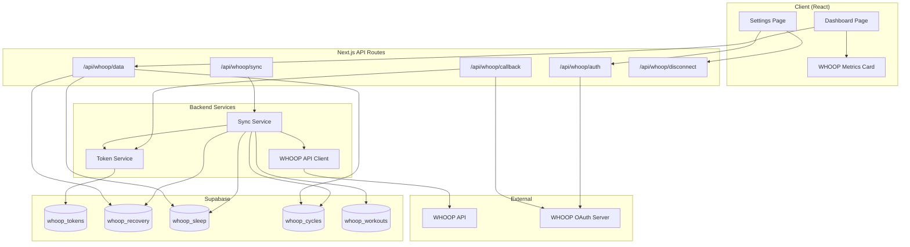
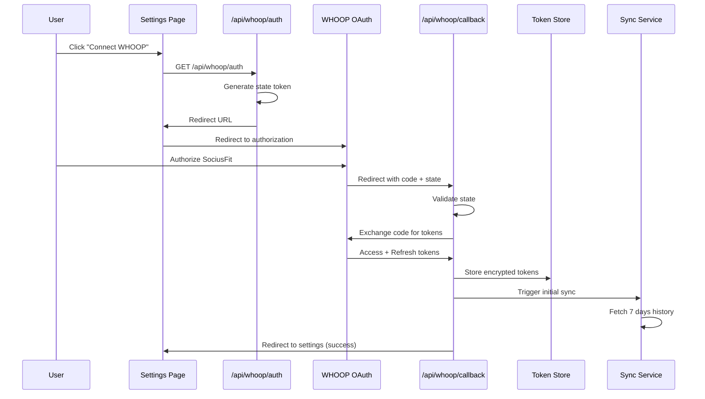

# Design Document: WHOOP Integration

## Overview

This design document describes the technical architecture for integrating WHOOP wearable data into SociusFit. The integration enables users to connect their WHOOP accounts via OAuth 2.0, automatically sync recovery, strain, sleep, and workout data, and receive AI-powered cross-domain insights correlating physiological metrics with existing workout and nutrition tracking.

The design follows SociusFit's existing patterns: Next.js API routes for backend logic, Supabase for database and authentication, and Claude AI for intelligent insights generation.

## Architecture



### OAuth 2.0 Flow



## Components and Interfaces

### API Routes

#### `/api/whoop/auth` - Initiate OAuth Flow
```typescript
// GET: Redirect user to WHOOP authorization
interface AuthResponse {
  redirectUrl: string;
}
```

#### `/api/whoop/callback` - Handle OAuth Callback
```typescript
// GET: Exchange authorization code for tokens
interface CallbackParams {
  code: string;
  state: string;
}
```

#### `/api/whoop/sync` - Trigger Data Sync
```typescript
// POST: Manually trigger sync or called by scheduler
interface SyncRequest {
  fullSync?: boolean; // If true, fetch 7 days; otherwise incremental
}

interface SyncResponse {
  success: boolean;
  recordsSynced: {
    recovery: number;
    sleep: number;
    cycles: number;
    workouts: number;
  };
  lastSyncAt: string;
}
```

#### `/api/whoop/data` - Fetch WHOOP Data
```typescript
// GET: Retrieve user's WHOOP data for display
interface WhoopDataRequest {
  type?: 'recovery' | 'sleep' | 'cycle' | 'workout' | 'all';
  startDate?: string;
  endDate?: string;
}

interface WhoopDataResponse {
  recovery?: WhoopRecovery;
  sleep?: WhoopSleep;
  cycle?: WhoopCycle;
  workouts?: WhoopWorkout[];
  connectionStatus: 'connected' | 'disconnected' | 'expired';
  lastSyncAt?: string;
}
```

#### `/api/whoop/disconnect` - Remove WHOOP Connection
```typescript
// POST: Disconnect WHOOP and delete tokens
interface DisconnectResponse {
  success: boolean;
  message: string;
}
```

### Service Interfaces

#### Token Service
```typescript
interface TokenService {
  // Store encrypted tokens for user
  storeTokens(userId: string, tokens: WhoopTokens): Promise<void>;
  
  // Retrieve and decrypt tokens
  getTokens(userId: string): Promise<WhoopTokens | null>;
  
  // Refresh expired access token
  refreshAccessToken(userId: string): Promise<WhoopTokens>;
  
  // Delete all tokens for user
  deleteTokens(userId: string): Promise<void>;
  
  // Check if tokens are valid/not expired
  validateTokens(userId: string): Promise<TokenValidationResult>;
}

interface WhoopTokens {
  accessToken: string;
  refreshToken: string;
  expiresAt: Date;
  scope: string;
}

interface TokenValidationResult {
  valid: boolean;
  needsRefresh: boolean;
  expired: boolean;
}
```

#### WHOOP API Client
```typescript
interface WhoopApiClient {
  // Fetch recovery data for date range
  getRecovery(accessToken: string, startDate: Date, endDate: Date): Promise<WhoopRecoveryResponse[]>;
  
  // Fetch sleep data for date range
  getSleep(accessToken: string, startDate: Date, endDate: Date): Promise<WhoopSleepResponse[]>;
  
  // Fetch cycle (strain) data for date range
  getCycles(accessToken: string, startDate: Date, endDate: Date): Promise<WhoopCycleResponse[]>;
  
  // Fetch workout data for date range
  getWorkouts(accessToken: string, startDate: Date, endDate: Date): Promise<WhoopWorkoutResponse[]>;
  
  // Exchange authorization code for tokens
  exchangeCodeForTokens(code: string): Promise<WhoopTokens>;
  
  // Refresh access token
  refreshToken(refreshToken: string): Promise<WhoopTokens>;
}
```

#### Sync Service
```typescript
interface SyncService {
  // Perform full sync (7 days history)
  fullSync(userId: string): Promise<SyncResult>;
  
  // Perform incremental sync (since last sync)
  incrementalSync(userId: string): Promise<SyncResult>;
  
  // Get sync status for user
  getSyncStatus(userId: string): Promise<SyncStatus>;
}

interface SyncResult {
  success: boolean;
  recordsSynced: {
    recovery: number;
    sleep: number;
    cycles: number;
    workouts: number;
  };
  errors?: string[];
}

interface SyncStatus {
  lastSyncAt: Date | null;
  nextSyncAt: Date | null;
  status: 'idle' | 'syncing' | 'error';
  errorMessage?: string;
}
```

### React Components

#### WhoopMetricsCard
```typescript
interface WhoopMetricsCardProps {
  recovery?: WhoopRecovery;
  sleep?: WhoopSleep;
  cycle?: WhoopCycle;
  isLoading: boolean;
  isConnected: boolean;
  onConnect: () => void;
}
```

#### WhoopConnectionSettings
```typescript
interface WhoopConnectionSettingsProps {
  isConnected: boolean;
  lastSyncAt?: Date;
  connectionHealth: 'healthy' | 'unhealthy' | 'unknown';
  onConnect: () => void;
  onDisconnect: () => void;
  onReconnect: () => void;
}
```

## Data Models

### Database Schema

#### whoop_tokens
```sql
CREATE TABLE whoop_tokens (
  id UUID PRIMARY KEY DEFAULT gen_random_uuid(),
  user_id UUID NOT NULL REFERENCES auth.users(id) ON DELETE CASCADE,
  access_token_encrypted TEXT NOT NULL,
  refresh_token_encrypted TEXT NOT NULL,
  expires_at TIMESTAMPTZ NOT NULL,
  scope TEXT NOT NULL,
  created_at TIMESTAMPTZ DEFAULT NOW(),
  updated_at TIMESTAMPTZ DEFAULT NOW(),
  UNIQUE(user_id)
);

-- RLS Policy
ALTER TABLE whoop_tokens ENABLE ROW LEVEL SECURITY;

CREATE POLICY "Users can only access their own tokens"
  ON whoop_tokens FOR ALL
  USING (auth.uid() = user_id);

CREATE INDEX idx_whoop_tokens_user_id ON whoop_tokens(user_id);
CREATE INDEX idx_whoop_tokens_expires_at ON whoop_tokens(expires_at);
```

#### whoop_recovery
```sql
CREATE TABLE whoop_recovery (
  id UUID PRIMARY KEY DEFAULT gen_random_uuid(),
  user_id UUID NOT NULL REFERENCES auth.users(id) ON DELETE CASCADE,
  cycle_id BIGINT NOT NULL, -- WHOOP's cycle identifier
  date DATE NOT NULL,
  recovery_score INTEGER, -- 0-100
  resting_heart_rate INTEGER, -- bpm
  hrv_rmssd_milli DECIMAL(10,2), -- milliseconds
  spo2_percentage DECIMAL(5,2), -- blood oxygen %
  skin_temp_celsius DECIMAL(5,2),
  created_at TIMESTAMPTZ DEFAULT NOW(),
  UNIQUE(user_id, cycle_id)
);

ALTER TABLE whoop_recovery ENABLE ROW LEVEL SECURITY;

CREATE POLICY "Users can only access their own recovery data"
  ON whoop_recovery FOR ALL
  USING (auth.uid() = user_id);

CREATE INDEX idx_whoop_recovery_user_date ON whoop_recovery(user_id, date DESC);
```

#### whoop_sleep
```sql
CREATE TABLE whoop_sleep (
  id UUID PRIMARY KEY DEFAULT gen_random_uuid(),
  user_id UUID NOT NULL REFERENCES auth.users(id) ON DELETE CASCADE,
  sleep_id BIGINT NOT NULL, -- WHOOP's sleep identifier
  date DATE NOT NULL,
  sleep_performance_percentage INTEGER, -- 0-100
  sleep_consistency_percentage INTEGER, -- 0-100
  sleep_efficiency_percentage DECIMAL(5,2),
  respiratory_rate DECIMAL(5,2), -- breaths per minute
  total_sleep_duration_ms BIGINT,
  is_nap BOOLEAN DEFAULT FALSE,
  created_at TIMESTAMPTZ DEFAULT NOW(),
  UNIQUE(user_id, sleep_id)
);

ALTER TABLE whoop_sleep ENABLE ROW LEVEL SECURITY;

CREATE POLICY "Users can only access their own sleep data"
  ON whoop_sleep FOR ALL
  USING (auth.uid() = user_id);

CREATE INDEX idx_whoop_sleep_user_date ON whoop_sleep(user_id, date DESC);
```

#### whoop_cycles
```sql
CREATE TABLE whoop_cycles (
  id UUID PRIMARY KEY DEFAULT gen_random_uuid(),
  user_id UUID NOT NULL REFERENCES auth.users(id) ON DELETE CASCADE,
  cycle_id BIGINT NOT NULL, -- WHOOP's cycle identifier
  date DATE NOT NULL,
  strain DECIMAL(5,2), -- 0-21 scale
  kilojoules INTEGER,
  average_heart_rate INTEGER,
  max_heart_rate INTEGER,
  created_at TIMESTAMPTZ DEFAULT NOW(),
  UNIQUE(user_id, cycle_id)
);

ALTER TABLE whoop_cycles ENABLE ROW LEVEL SECURITY;

CREATE POLICY "Users can only access their own cycle data"
  ON whoop_cycles FOR ALL
  USING (auth.uid() = user_id);

CREATE INDEX idx_whoop_cycles_user_date ON whoop_cycles(user_id, date DESC);
```

#### whoop_workouts
```sql
CREATE TABLE whoop_workouts (
  id UUID PRIMARY KEY DEFAULT gen_random_uuid(),
  user_id UUID NOT NULL REFERENCES auth.users(id) ON DELETE CASCADE,
  whoop_workout_id BIGINT NOT NULL, -- WHOOP's workout identifier
  date DATE NOT NULL,
  sport_name TEXT,
  sport_id INTEGER,
  strain DECIMAL(5,2),
  average_heart_rate INTEGER,
  max_heart_rate INTEGER,
  distance_meter DECIMAL(10,2),
  altitude_gain_meter DECIMAL(10,2),
  duration_ms BIGINT,
  created_at TIMESTAMPTZ DEFAULT NOW(),
  UNIQUE(user_id, whoop_workout_id)
);

ALTER TABLE whoop_workouts ENABLE ROW LEVEL SECURITY;

CREATE POLICY "Users can only access their own workout data"
  ON whoop_workouts FOR ALL
  USING (auth.uid() = user_id);

CREATE INDEX idx_whoop_workouts_user_date ON whoop_workouts(user_id, date DESC);
```

#### whoop_sync_status
```sql
CREATE TABLE whoop_sync_status (
  id UUID PRIMARY KEY DEFAULT gen_random_uuid(),
  user_id UUID NOT NULL REFERENCES auth.users(id) ON DELETE CASCADE,
  last_sync_at TIMESTAMPTZ,
  next_sync_at TIMESTAMPTZ,
  status TEXT DEFAULT 'idle', -- 'idle', 'syncing', 'error'
  error_message TEXT,
  records_synced JSONB DEFAULT '{}',
  created_at TIMESTAMPTZ DEFAULT NOW(),
  updated_at TIMESTAMPTZ DEFAULT NOW(),
  UNIQUE(user_id)
);

ALTER TABLE whoop_sync_status ENABLE ROW LEVEL SECURITY;

CREATE POLICY "Users can only access their own sync status"
  ON whoop_sync_status FOR ALL
  USING (auth.uid() = user_id);
```

### TypeScript Interfaces

```typescript
// WHOOP Data Types
interface WhoopRecovery {
  id: string;
  userId: string;
  cycleId: number;
  date: Date;
  recoveryScore: number | null;
  restingHeartRate: number | null;
  hrvRmssdMilli: number | null;
  spo2Percentage: number | null;
  skinTempCelsius: number | null;
  createdAt: Date;
}

interface WhoopSleep {
  id: string;
  userId: string;
  sleepId: number;
  date: Date;
  sleepPerformancePercentage: number | null;
  sleepConsistencyPercentage: number | null;
  sleepEfficiencyPercentage: number | null;
  respiratoryRate: number | null;
  totalSleepDurationMs: number | null;
  isNap: boolean;
  createdAt: Date;
}

interface WhoopCycle {
  id: string;
  userId: string;
  cycleId: number;
  date: Date;
  strain: number | null;
  kilojoules: number | null;
  averageHeartRate: number | null;
  maxHeartRate: number | null;
  createdAt: Date;
}

interface WhoopWorkout {
  id: string;
  userId: string;
  whoopWorkoutId: number;
  date: Date;
  sportName: string | null;
  sportId: number | null;
  strain: number | null;
  averageHeartRate: number | null;
  maxHeartRate: number | null;
  distanceMeter: number | null;
  altitudeGainMeter: number | null;
  durationMs: number | null;
  createdAt: Date;
}

interface WhoopSyncStatus {
  id: string;
  userId: string;
  lastSyncAt: Date | null;
  nextSyncAt: Date | null;
  status: 'idle' | 'syncing' | 'error';
  errorMessage: string | null;
  recordsSynced: {
    recovery?: number;
    sleep?: number;
    cycles?: number;
    workouts?: number;
  };
}

// Connection status for UI
interface WhoopConnectionStatus {
  isConnected: boolean;
  connectionHealth: 'healthy' | 'unhealthy' | 'expired' | 'unknown';
  lastSyncAt: Date | null;
  expiresAt: Date | null;
}
```


## Correctness Properties

*A property is a characteristic or behavior that should hold true across all valid executions of a system—essentially, a formal statement about what the system should do. Properties serve as the bridge between human-readable specifications and machine-verifiable correctness guarantees.*

### Property 1: Token Encryption Round-Trip

*For any* valid access token and refresh token pair, encrypting then decrypting SHALL produce the original token values, AND the encrypted value SHALL differ from the plaintext value.

**Validates: Requirements 1.3, 2.1**

### Property 2: OAuth Authorization URL Construction

*For any* OAuth initiation request with a valid user session, the generated authorization URL SHALL contain the required parameters: client_id, redirect_uri, response_type=code, scope (with all required WHOOP scopes), and a cryptographically random state token.

**Validates: Requirements 1.1**

### Property 3: OAuth Error Handling

*For any* OAuth error response (invalid_grant, access_denied, server_error, etc.), the WHOOP_Integration_Service SHALL return an error object containing a user-friendly message and the original error code.

**Validates: Requirements 1.4, 2.3**

### Property 4: Disconnect Cleanup

*For any* user who disconnects WHOOP, after the disconnect operation completes, querying whoop_tokens for that user SHALL return no results, AND querying whoop_sync_status SHALL show status as 'idle' with null timestamps.

**Validates: Requirements 1.5**

### Property 5: Token Refresh Flow

*For any* user with expired access token but valid refresh token, calling the token refresh function SHALL return new valid tokens with a future expiration timestamp, AND the new tokens SHALL be stored in the database.

**Validates: Requirements 2.2, 2.4, 2.5**

### Property 6: Initial Sync Date Range

*For any* initial sync triggered after WHOOP connection, the date range requested from the WHOOP API SHALL span exactly 7 days from the current date (inclusive of today, exclusive of 8 days ago).

**Validates: Requirements 3.1**

### Property 7: WHOOP Data Field Extraction

*For any* valid WHOOP API response (recovery, sleep, cycle, or workout), all required fields defined in the schema SHALL be extracted and stored in the corresponding database table, with null values for any missing optional fields.

**Validates: Requirements 3.3, 3.4, 3.5, 3.6**

### Property 8: Retry with Exponential Backoff

*For any* transient API failure (rate limit, timeout, 5xx error), the sync service SHALL retry up to 3 times with delays following exponential backoff pattern (e.g., 1s, 2s, 4s), AND after 3 failures SHALL mark sync status as 'error'.

**Validates: Requirements 3.7, 8.1**

### Property 9: Row-Level Security Enforcement

*For any* authenticated user querying WHOOP data tables, the results SHALL only contain records where user_id matches the authenticated user's ID, regardless of what user_id values exist in the database.

**Validates: Requirements 4.5**

### Property 10: Recovery Score Color Coding

*For any* recovery score value, the color coding function SHALL return: 'green' for scores > 66, 'yellow' for scores between 34 and 66 (inclusive), and 'red' for scores < 34.

**Validates: Requirements 5.1**

### Property 11: Fallback to Recent Data

*For any* data request where today's WHOOP data is not available, the response SHALL include the most recent available data along with a timestamp indicating when that data was recorded.

**Validates: Requirements 5.4**

### Property 12: Threshold-Based Recommendations

*For any* recovery score below 34%, the generated insights SHALL include at least one recommendation for reduced training intensity. *For any* sleep performance below 70%, the generated insights SHALL include at least one recommendation for recovery-focused activities.

**Validates: Requirements 6.4, 6.5**

### Property 13: WHOOP Context in Query Responses

*For any* user query about performance when WHOOP data exists, the AI prompt context SHALL include relevant WHOOP metrics (recovery, strain, sleep) from the queried time period.

**Validates: Requirements 6.6**

### Property 14: Cached Data with Staleness Indicator

*For any* API failure when fetching WHOOP data, if cached data exists, the response SHALL include the cached data along with a staleness indicator showing time since last successful sync.

**Validates: Requirements 8.2**

### Property 15: API Response Validation

*For any* WHOOP API response, the validation function SHALL reject responses missing required fields (cycle_id for recovery/cycles, sleep_id for sleep, workout_id for workouts) and accept responses with all required fields present.

**Validates: Requirements 8.5**

## Error Handling

### OAuth Errors

| Error Type | Handling Strategy |
|------------|-------------------|
| `invalid_grant` | Clear stored tokens, redirect to settings with "Please reconnect WHOOP" message |
| `access_denied` | Redirect to settings with "Authorization was denied" message |
| `invalid_scope` | Log error, redirect with "Invalid permissions requested" message |
| `server_error` | Retry once, then redirect with "WHOOP service unavailable" message |
| `state_mismatch` | Log security warning, redirect with "Security validation failed" message |

### Token Errors

| Error Type | Handling Strategy |
|------------|-------------------|
| Token expired | Attempt refresh using refresh token |
| Refresh failed | Mark connection as unhealthy, notify user to reconnect |
| Decryption failed | Log error, delete corrupted tokens, prompt reconnection |
| Token not found | Return disconnected status |

### Sync Errors

| Error Type | Handling Strategy |
|------------|-------------------|
| Rate limited (429) | Exponential backoff: 1s, 2s, 4s, then mark as error |
| Server error (5xx) | Retry up to 3 times with backoff |
| Network timeout | Retry once, then use cached data |
| Partial data | Store available data, log missing fields |
| Invalid response | Skip record, log validation error |

### Database Errors

| Error Type | Handling Strategy |
|------------|-------------------|
| Unique constraint violation | Upsert pattern - update existing record |
| Foreign key violation | Log error, skip record |
| Connection error | Retry with backoff, fail gracefully |

### Error Logging Format

```typescript
interface WhoopErrorLog {
  timestamp: Date;
  userId: string;
  operation: 'oauth' | 'sync' | 'token_refresh' | 'data_fetch';
  errorType: string;
  errorMessage: string;
  context: {
    endpoint?: string;
    statusCode?: number;
    retryCount?: number;
    requestId?: string;
  };
}
```

## Testing Strategy

### Dual Testing Approach

This feature requires both unit tests and property-based tests for comprehensive coverage:

- **Unit tests**: Verify specific examples, edge cases, integration points, and error conditions
- **Property tests**: Verify universal properties across all valid inputs using randomized testing

### Property-Based Testing Configuration

- **Library**: fast-check (already in project dependencies)
- **Minimum iterations**: 100 per property test
- **Tag format**: `Feature: whoop-integration, Property {number}: {property_text}`

### Test Categories

#### Unit Tests

1. **OAuth Flow Tests**
   - Authorization URL generation with correct parameters
   - State token validation
   - Token exchange success and failure cases
   - Redirect URL construction

2. **Token Service Tests**
   - Encryption/decryption correctness
   - Token storage and retrieval
   - Expiration checking
   - Refresh token flow

3. **Sync Service Tests**
   - Date range calculation for initial sync
   - Incremental sync logic
   - Data transformation from API to database format
   - Error handling and retry logic

4. **Dashboard Component Tests**
   - Rendering with connected/disconnected states
   - Loading states
   - Color coding for recovery scores
   - Fallback data display

5. **Settings Component Tests**
   - Connection status display
   - Connect/disconnect button states
   - Confirmation dialog behavior

#### Property-Based Tests

Each correctness property from the design document SHALL be implemented as a property-based test:

1. **Property 1**: Token encryption round-trip
2. **Property 2**: OAuth URL construction
3. **Property 3**: OAuth error handling
4. **Property 4**: Disconnect cleanup
5. **Property 5**: Token refresh flow
6. **Property 6**: Initial sync date range
7. **Property 7**: WHOOP data field extraction
8. **Property 8**: Retry with exponential backoff
9. **Property 9**: RLS enforcement
10. **Property 10**: Recovery score color coding
11. **Property 11**: Fallback to recent data
12. **Property 12**: Threshold-based recommendations
13. **Property 13**: WHOOP context in queries
14. **Property 14**: Cached data with staleness
15. **Property 15**: API response validation

### Test Data Generators

```typescript
// Generate random WHOOP recovery data
const recoveryArbitrary = fc.record({
  cycle_id: fc.integer({ min: 1 }),
  recovery_score: fc.integer({ min: 0, max: 100 }),
  resting_heart_rate: fc.integer({ min: 40, max: 100 }),
  hrv_rmssd_milli: fc.float({ min: 10, max: 200 }),
  spo2_percentage: fc.float({ min: 90, max: 100 }),
  skin_temp_celsius: fc.float({ min: 30, max: 40 })
});

// Generate random WHOOP sleep data
const sleepArbitrary = fc.record({
  sleep_id: fc.integer({ min: 1 }),
  sleep_performance_percentage: fc.integer({ min: 0, max: 100 }),
  sleep_consistency_percentage: fc.integer({ min: 0, max: 100 }),
  sleep_efficiency_percentage: fc.float({ min: 0, max: 100 }),
  respiratory_rate: fc.float({ min: 10, max: 25 })
});

// Generate random OAuth tokens
const tokenArbitrary = fc.record({
  accessToken: fc.string({ minLength: 20, maxLength: 100 }),
  refreshToken: fc.string({ minLength: 20, maxLength: 100 }),
  expiresIn: fc.integer({ min: 3600, max: 86400 })
});
```

### Integration Tests

1. **End-to-end OAuth flow** (mocked WHOOP API)
2. **Full sync cycle** with database verification
3. **Dashboard data loading** with various connection states
4. **Cross-domain insights** with WHOOP + workout + nutrition data

### Test Environment

- Use Vitest (existing test framework)
- Mock WHOOP API responses
- Use test database with RLS enabled
- Isolate tests with unique user IDs
