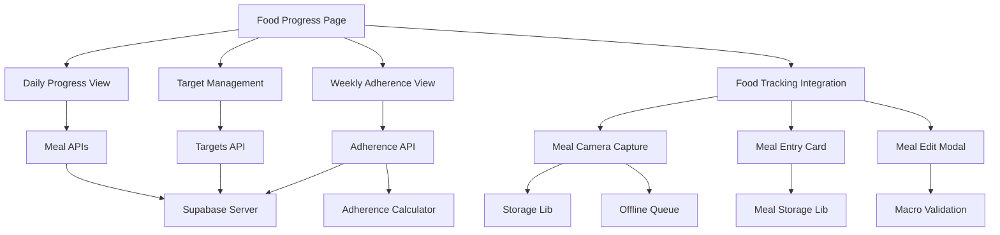
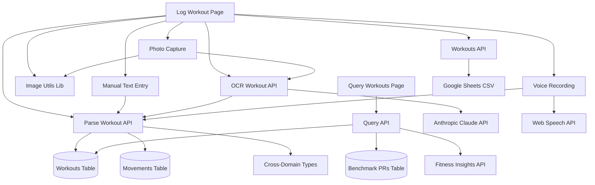
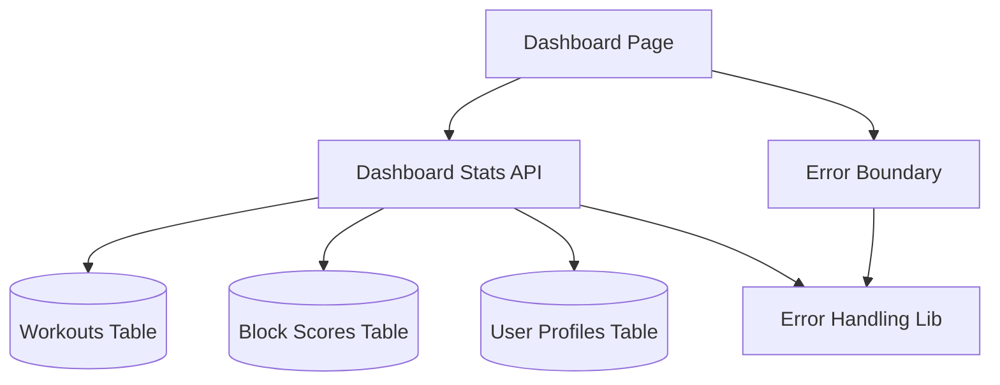
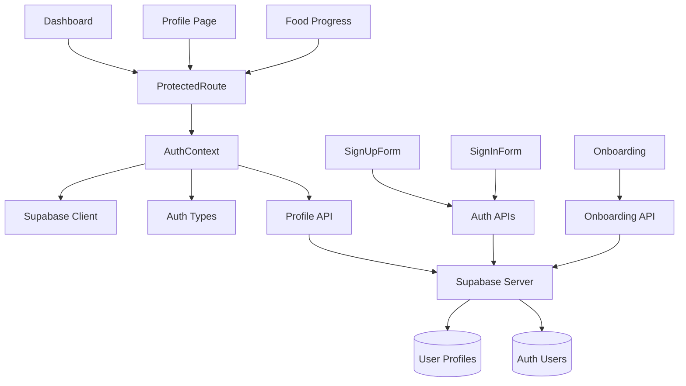
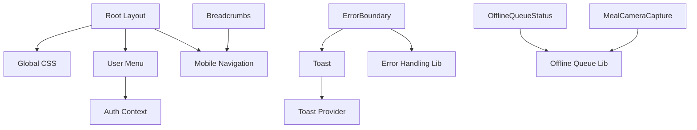

# Component Dependency Graph

> **Visual representation of how components depend on each other. Use this to understand the ripple effects of changes.**

## 🎯 **Core System Dependencies**

```mermaid
graph TD
    %% Core Infrastructure
    AuthContext[AuthContext] --> ProtectedRoute[ProtectedRoute]
    AuthContext --> UserMenu[UserMenu]
    AuthContext --> ProfilePage[Profile Page]
    AuthContext --> Dashboard[Dashboard]
    
    %% Supabase Clients
    SupabaseServer[Supabase Server] --> AuthAPIs[Auth APIs]
    SupabaseServer --> ProfileAPIs[Profile APIs]
    SupabaseServer --> MealAPIs[Meal APIs]
    SupabaseServer --> DashboardAPI[Dashboard API]
    
    %% Layout System
    RootLayout[Root Layout] --> AuthProvider[Auth Provider]
    RootLayout --> ToastProvider[Toast Provider]
    RootLayout --> ErrorBoundary[Error Boundary]
    RootLayout --> Navigation[Navigation]
    
    %% Authentication Flow
    SignUpPage[Sign Up Page] --> SignUpForm[Sign Up Form]
    SignInPage[Sign In Page] --> SignInForm[Sign In Form]
    OnboardingPage[Onboarding] --> BodyMetricsForm[Body Metrics Form]
    OnboardingPage --> GoalsSelection[Goals Selection]
    
    %% Profile System
    ProfilePage --> BodyMetricsForm
    ProfilePage --> GoalsSelection
    BodyMetricsForm --> AuthContext
    GoalsSelection --> AuthContext
```



## 🍽️ **Food Tracking Dependencies**



## 🏋️ **Workout Tracking Dependencies**





## 🔐 **Authentication Dependencies**



## 📊 **Dashboard Dependencies**



## 🎨 **UI Component Dependencies**

## ⚡ **Critical Path Analysis**

### **High-Impact Components** (Changes affect multiple systems):
```
AuthContext ──┬── All Protected Pages
              ├── User Menu
              ├── Profile Management
              └── Authentication Flow

Root Layout ──┬── All Pages
              ├── Navigation
              ├── Global Styling
              └── Provider Wrappers

Supabase Server ──┬── All API Routes
                  ├── Authentication
                  ├── Data Operations
                  └── File Storage

Image Utils ──┬── Photo Compression
              ├── OCR Processing
              └── File Validation
```

### **Medium-Impact Components** (Changes affect specific features):
```
Food Tracking Integration ──┬── Meal Components
                           ├── Progress Views
                           └── Target Management

Workout Parsing API ──┬── All Workout Input Methods
                     ├── Photo OCR Processing
                     └── Voice Transcription

Profile Forms ──┬── Onboarding Flow
               └── Profile Editing

Dashboard Stats API ──┬── Dashboard Display
                     └── Data Aggregation

OCR Workout API ──┬── Photo-based Logging
                 └── AI Text Extraction
```

### **Low-Impact Components** (Changes are mostly isolated):
```
Individual Meal Components ── Specific UI Areas
Individual Pages ── Page-Specific Functionality
Utility Libraries ── Helper Functions
```

## 🔄 **Data Flow Dependencies**

### **User Authentication Flow:**
```
User Input → Auth Form → Auth API → Supabase Auth → AuthContext → UI Update
```

### **Profile Update Flow:**
```
Form Input → AuthContext.updateProfile() → Profile API → Database → State Update
```

### **Food Tracking Flow:**
```
Camera → Upload API → AI Analysis → Meal Storage → Progress Calculation → UI Display
```

### **Workout Tracking Flow:**
```
Multi-Modal Input → AI Processing → Structured Data → Storage → Query Analysis

Photo: Camera → Compression → OCR API → Text → Parse API → Database
Voice: Speech API → Transcription → Parse API → Database  
Manual: Text Input → Parse API → Database
Query: Question → Query API → Database Search → AI Analysis → Response
```

## 🚨 **Breaking Change Risk Matrix**

### **Critical Risk** (Will break multiple systems):
- AuthContext interface changes
- Supabase client modifications
- Database schema changes
- API route authentication changes

### **High Risk** (Will break specific features):
- Profile API response format changes
- Meal storage format changes
- Navigation structure changes
- Error handling pattern changes

### **Medium Risk** (May require updates):
- Individual component prop changes
- Utility function signature changes
- CSS class name changes
- Type definition updates

### **Low Risk** (Isolated impact):
- Individual page styling
- Static content updates
- Individual component internal logic
- Documentation updates

## 🧪 **Testing Impact by Component**

### **Components Requiring Full Integration Testing:**
- AuthContext (affects entire app)
- Root Layout (affects all pages)
- Supabase clients (affects all data operations)
- Protected Route (affects all authenticated pages)

### **Components Requiring Feature Testing:**
- Food Tracking Integration (meal workflow)
- Profile Forms (onboarding + editing)
- Dashboard Stats (data aggregation)
- Navigation (mobile + desktop)

### **Components Requiring Unit Testing:**
- Individual form components
- Utility libraries
- Individual API routes
- Calculation functions

## 📋 **Change Planning Checklist**

### **Before Making Changes:**
1. **Identify Dependencies**: Use this graph to find all dependent components
2. **Assess Impact Level**: Determine if changes are Critical/High/Medium/Low risk
3. **Plan Testing Strategy**: Based on impact level and dependencies
4. **Consider Migration Needs**: For database or API changes
5. **Update Documentation**: Keep this map current with changes

### **After Making Changes:**
1. **Test Critical Paths**: Ensure core user flows still work
2. **Verify Dependencies**: Check all identified dependent components
3. **Update Types**: If interfaces changed
4. **Update Tests**: Reflect new functionality
5. **Update Documentation**: Keep architecture map current

---

*This dependency graph should be updated whenever new components are added or major refactoring occurs.*